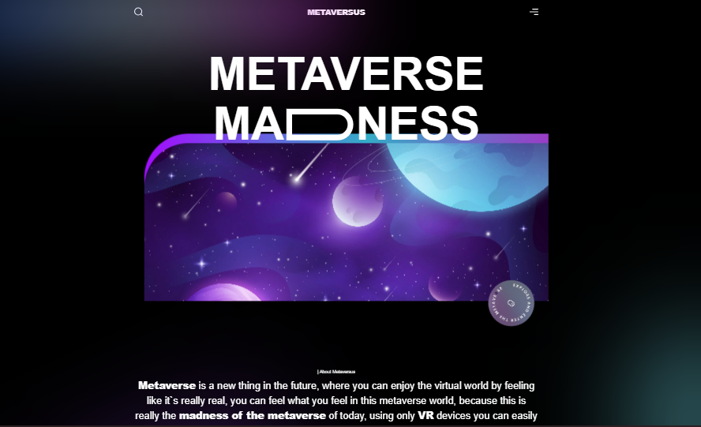
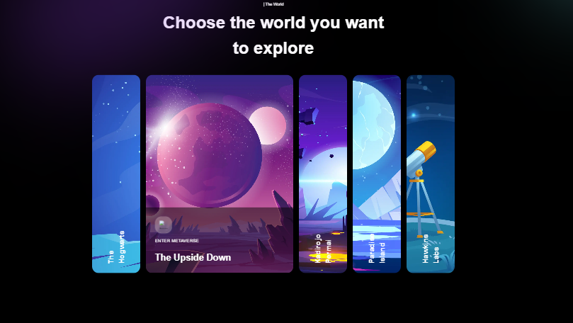
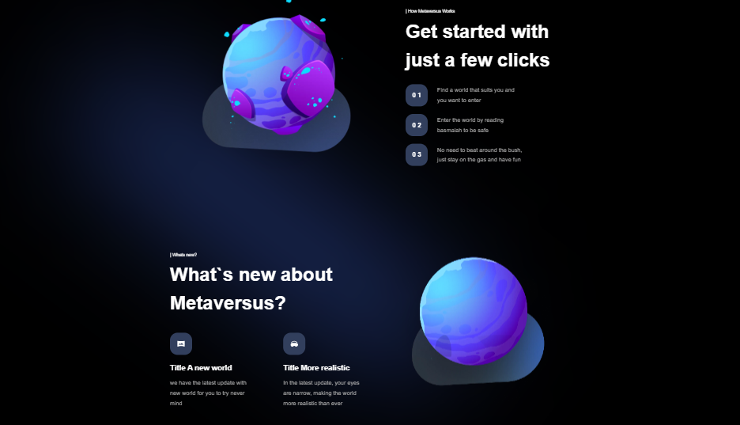
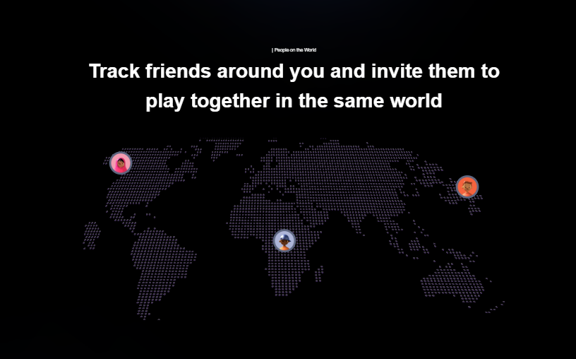
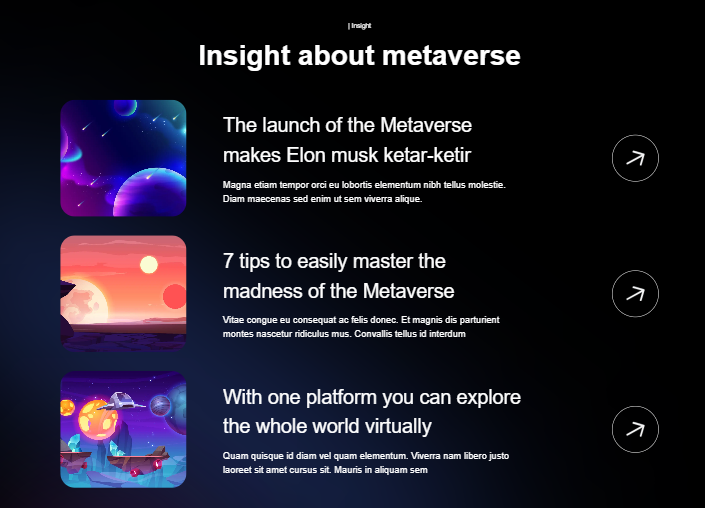
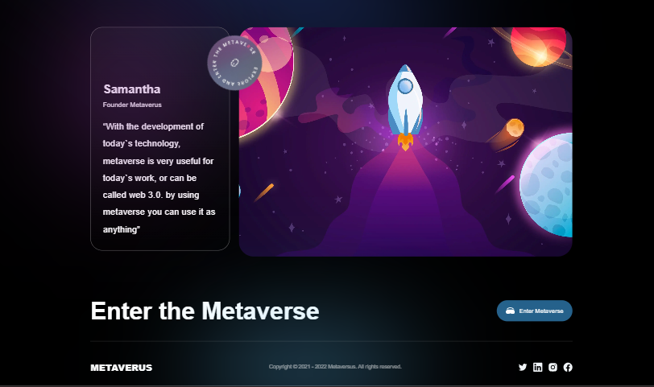

<!DOCTYPE html>
<html lang="en">
<body>
  <h1> Metaversus </h1>
  
This project based on Task-01 Responsive landing page by Prodigy InfoTech Internship.
    This project is a modern UI/UX design built using Next.js, Tailwind CSS, and Framer Motion for smooth animations. It's inspired by the Figma design at link to Figma design
 

  
  <h2>Features</h2>
  <ul>
      <li>Built with Next.js for static site generation capabilities.</li>
      <li>Uses Tailwind CSS for rapid UI development.</li>
      <li>Framer Motion for creating interactive and performant animations.</li>
      <li>Implements the design elements like carousels , features ,Insight,world modals and much more. </li>
 </ul>
 
 <h2>Website</h2>
 
Try it out on your devices <a href="https://prodigy-wd-01-4victorys-projects.vercel.app/">prodigy-wd-01-4victorys-projects.vercel.app</a>

  <h2>Preview Images</h2>

  
Here are previews of the StopWatch on various screen sizes:

  <figure>
    <figcaption><b>Navigation bar and Hero section</b></figcaption>
    
  </figure>
  <figure>
      <figcaption><b>Carousal</b></figcaption>
    
  </figure>
  <figure>
      <figcaption><b>What`s new and how it works</b></figcaption>
    
  </figure>
  <figure>
      <figcaption><b>People on the world</b></figcaption>
    
  </figure>
  <figure>
      <figcaption><b>Insights</b></figcaption>
    
  </figure>
  <figure>
      <figcaption><b>Hero grid and Footer</b></figcaption>
    
  </figure>
  

  <i><b>
Happy coding!
</b></i>
</body>
</html>

